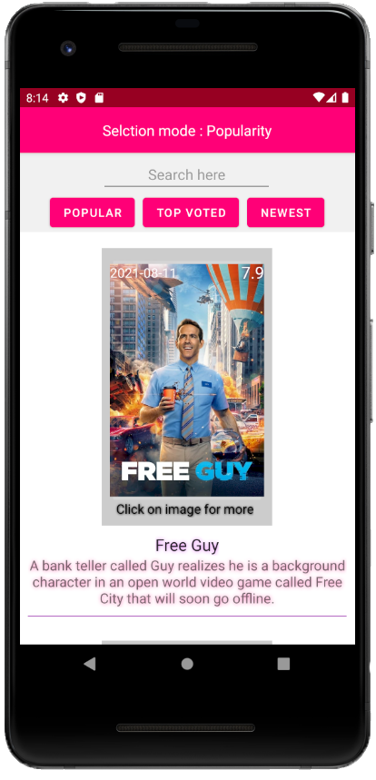
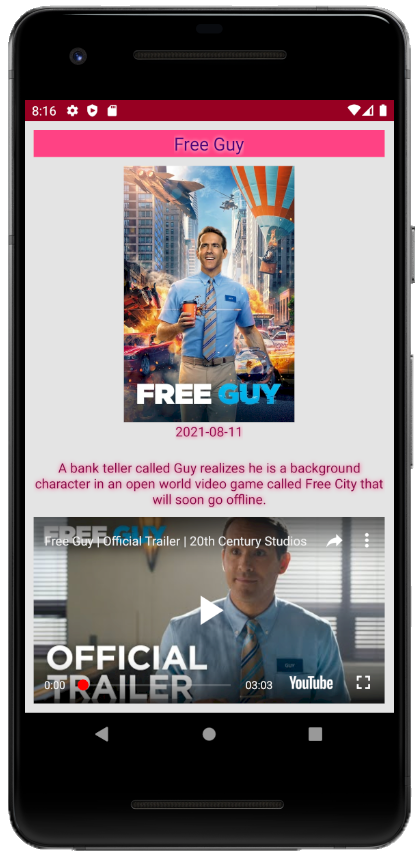
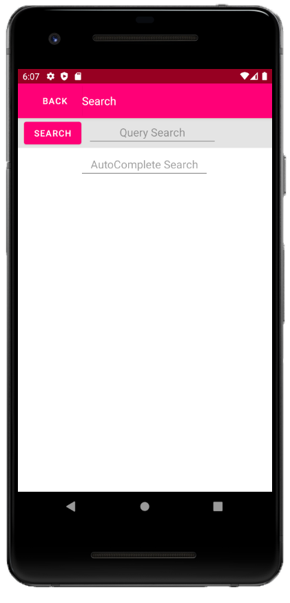
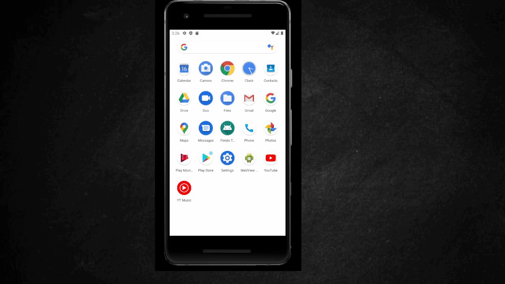

# Pendo Android app based on TMDB's api :iphone:

## Info related to me: :wave:
**Name**  *Dor Bismuth*

**email**  *dor.bismut@gmail.com*

## Info related to the app: :point_left:
*This is an native Android app written in Java.*

*App built using Android Studio build 2020.3.1 and java version 1.8.0_301*

*The main idea of this project is to parse [themoviedb.org](https://www.themoviedb.org/)* API
*with different approaches.*
## Notes: :newspaper:

**Screen size compatibility**  *I made a couple tweaks on the UI which may display differently across*

*variety of other android devices and emulators ( I might be wrong tho ) and Iev tested it successfully on my*

*smasung A50 running Android 11 and on my emulator Pixel 2 API 30*

**Actionbar**  *MovieActivity extends  YouTubeBaseActivity which doesnot seem to have an action bar,*

*but I did made a practice using it on MainActivity where it shows which selection mode is selected.*

**Why I added an youtube view**  *I thought that it might be a cool extra , even if not really requested besides*

*the fact that AppCompatActivity cannot be extended and action bar is not part of it I think it cant make*

*any worse since I have used action bar on the MainActivity and also added some sort of actionbar to MovieActivity.*

### Libraries that I used and why: :books:
**[okhttp](https://square.github.io)**  *used to retrieve youtbe's video link from the raw api*

**[YouTubeAndroidPlayerApi.jar](https://developers.google.com/youtube/android/player/downloads)**  *This libary is needed inorder to have a youtubeview.*

**[retrofit](https://square.github.io/retrofit/)**  *My rest client for handling the API calls.*

**[picasso](https://square.github.io/picasso/)**  *Used to load images form a url to a view*

**[androidx.recyclerview](https://developer.android.com/jetpack/androidx/releases/recyclerview)**  *Better when fetching large sets of data also minimizing memory usage.*

 

### Classed and methods : :open_book: 

##### Activities :green_book:
[MainActivity](https://github.com/D0rb/PendoTMDBApp/blob/master/app/src/main/java/com/example/pendotmdb/activities/MainActivity.java)  *Main Activity , shows the movies in a recyclerview*
 
[MovieActivity](https://github.com/D0rb/PendoTMDBApp/blob/master/app/src/main/java/com/example/pendotmdb/activities/MovieActivity.java)  *The activity where a single movie is shown*
  
[SearchActivity](https://github.com/D0rb/PendoTMDBApp/blob/master/app/src/main/java/com/example/pendotmdb/activities/SearchActivity.java)  *The activity where the user should search at*
  
 ##### Adapters :closed_book:
 [MovieListAdapter](https://github.com/D0rb/PendoTMDBApp/blob/master/app/src/main/java/com/example/pendotmdb/activities/MovieListAdapter.java)  *The adapter for the RecyclerView, including the **ViewHolder** which is also my **MVVM** ,*
*based on [movieObj](https://github.com/D0rb/PendoTMDBApp/blob/master/app/src/main/java/com/example/pendotmdb/objects/movieObj.java);*
 ##### Api :closed_book:
**[apiHandler](https://github.com/D0rb/PendoTMDBApp/blob/master/app/src/main/java/com/example/pendotmdb/api/apiHandler.java)** *API handler class making the calls to the service*

**[apiInterface](https://github.com/D0rb/PendoTMDBApp/blob/master/app/src/main/java/com/example/pendotmdb/api/apiInterface.java)**  *Interface for the API calls methods.*
 ##### Extra  :orange_book:
 [helpers](https://github.com/D0rb/PendoTMDBApp/blob/master/app/src/main/java/com/example/pendotmdb/extra/helpers.java)  *Extra functions that I used in this project.*
 ##### Objects :orange_book:
 [movieListObj](https://github.com/D0rb/PendoTMDBApp/blob/master/app/src/main/java/com/example/pendotmdb/objects/movieListObj.java)  *The movie list object , holds as List of movies based on the call.*

  [movieObj](https://github.com/D0rb/PendoTMDBApp/blob/master/app/src/main/java/com/example/pendotmdb/objects/movieObj.java)  *The movie object , holds as a movie based on the call.*

  ##### Layouts :scroll:
[activity_main](https://github.com/D0rb/PendoTMDBApp/tree/master/app/src/main/res/layout/activity_main.xml) *The layout for the main activity ,uses [cell](https://github.com/D0rb/PendoTMDBApp/tree/master/app/src/main/res/layout/cell.xml)*

[activity_movie](https://github.com/D0rb/PendoTMDBApp/tree/master/app/src/main/res/layout/activity_movie.xml)  *The layout for the movie activity.*

[activity_search](https://github.com/D0rb/PendoTMDBApp/tree/master/app/src/main/res/layout/activity_search.xml)  *The layout for the search activity.*

### Sources that I used :
*TMDB documantion*

*Github*

*Stackoverflow*

*Android Arenal*

## App Preview:
  
 

